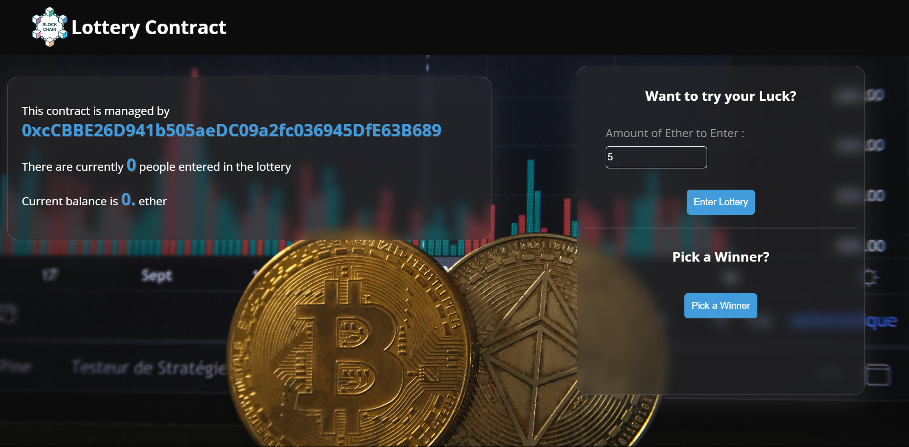

# Blockchain Lottery System with User-Friendly Frontend

Welcome to our Blockchain Lottery System! This project combines the transparency and security of blockchain technology with a user-friendly frontend interface to create a seamless and enjoyable lottery experience for users.

## Note

This lottery system is built using Solidity version 0.8.11.





## Features

- **Blockchain Integration**: Our lottery system is built on blockchain technology, ensuring transparency and security throughout the lottery process. The smart contract manages ticket purchases, prize distribution, and result verification.

- **User-Friendly Frontend**: The frontend interface provides an intuitive platform for users to participate in the lottery, check results, and manage prizes effortlessly. The interface is designed to enhance the overall user experience, making it accessible to both experienced blockchain users and newcomers.

- **Transparency**: With blockchain technology, every transaction and lottery drawing is recorded on the blockchain, providing a transparent and immutable record of the entire lottery process. Users can verify the fairness of the lottery results at any time.

## Getting Started

1. **Install Dependencies**: Ensure you have the necessary dependencies installed to run the frontend interface and interact with the blockchain. Run `npm install` to install all required dependencies.

2. **Deploy Smart Contract**: Deploy the smart contract onto your preferred blockchain network. You can find the deployment script in the root directory of the project. Customize the deployment parameters as needed, then run the script to deploy the contract.

3. **Set Up Environment Variables**: Create a `.env` file in the root directory of the project and add your mnemonic for deploying contracts. This file will be used to securely pass sensitive information to your application. Add the following line to your `.env` file:
    ```env
    MNEMONIC=your-mnemonic-phrase-here
    ```

4. **Set Up Frontend**: Clone or download the frontend interface code from our repository. The frontend is built using a React application, which runs on port 3000. Update the necessary configurations to connect the frontend to the deployed smart contract.

5. **Run the Frontend**:
    - Navigate to the frontend directory:
        ```sh
        cd frontend
        ```
    - Install the necessary dependencies:
        ```sh
        npm install
        ```
    - Start the React application:
        ```sh
        npm start
        ```
    This will launch the React application on port 3000, making it accessible at `http://localhost:3000`.

6. **Testing**: Test the lottery system by participating in the lottery, checking results, and managing prizes through the frontend interface. The test scripts are located in the `tests` folder. To run the tests, use the command:
    ```sh
    npm run test
    ```

7. **Deployment**: Once testing is complete, deploy the frontend interface to a web server or hosting platform of your choice. Ensure the server is configured to serve the React application correctly, and that it is connected to the deployed smart contract on the blockchain.

---

By following these steps, you can get your blockchain lottery system up and running, offering a transparent, secure, and user-friendly lottery experience. Enjoy the enhanced transparency and security that blockchain technology brings to the lottery process, and provide a seamless experience for your users with our intuitive React-based frontend.
```